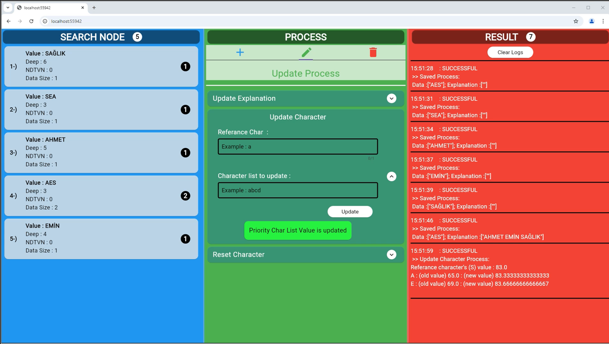

# <i> SearchNode (Graduate Project) - Visualize on Web Page</i>

 <br><br>

## <span id="about-project">1-) About The Project</span>

This project was created to visualize [SearchNode](https://github.com/AhmetEminSaglik/SearchNode) data structure on web page using with Spring Boot and Flutter.

## <span id="used-technologies">2-) Used Technologies</span>

  * JAVA SE (SearchNode data structure)
  * Spring Boot
  * Flutter

## <span id="requirements">3-) Requirements</span>

* <a href="https://www.oracle.com/tr/java/technologies/javase/jdk17-archive-downloads.html">JDK 17</a>
* <a href="https://www.jetbrains.com/idea/download/?section=windows"> IntelliJ IDEA (Community Edition) </a>


## <span id="installation">4-) Installation (Run In IntelliJ IDEA)</span>

**1.** Copy and paste the following command in your cmd.

```
git clone https://github.com/AhmetEminSaglik/SearchNode-ws-web.git
```

**2.**  To import/install  <span style="color:red;font-weight:bold"> SearchNode </span> library, please [click here](https://github.com/AhmetEminSaglik/SearchNode?tab=readme-ov-file#6--installation-run-in-intellij-idea) to learn how to do it. 

**3.**  Open the following folder in Intellij IDEA. (Ensure Step 2 is completed.)
```
 SearchNode-ws-web/ws-searchnode
```
 Then launch the program. 

**4.**  Open the following folder in Android Studio or Visual Studio Code, select Chrome or another web browser, and launch the program.
```
SearchNode-ws-web/flutter_web_searchnode
```
**5.** The application is now ready to use.